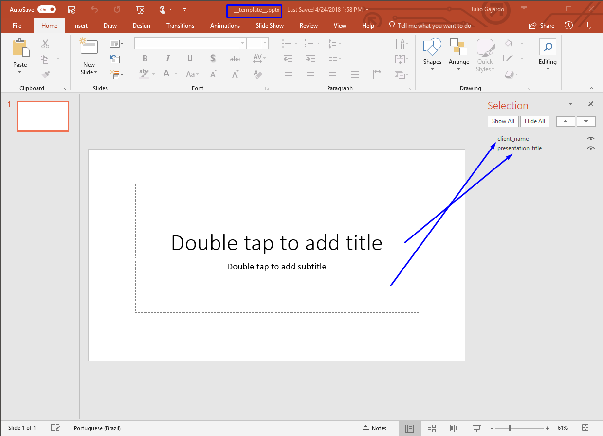
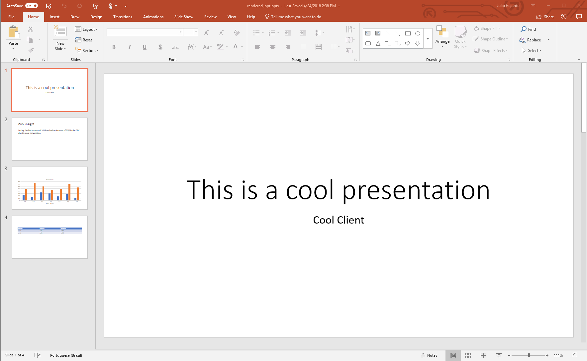
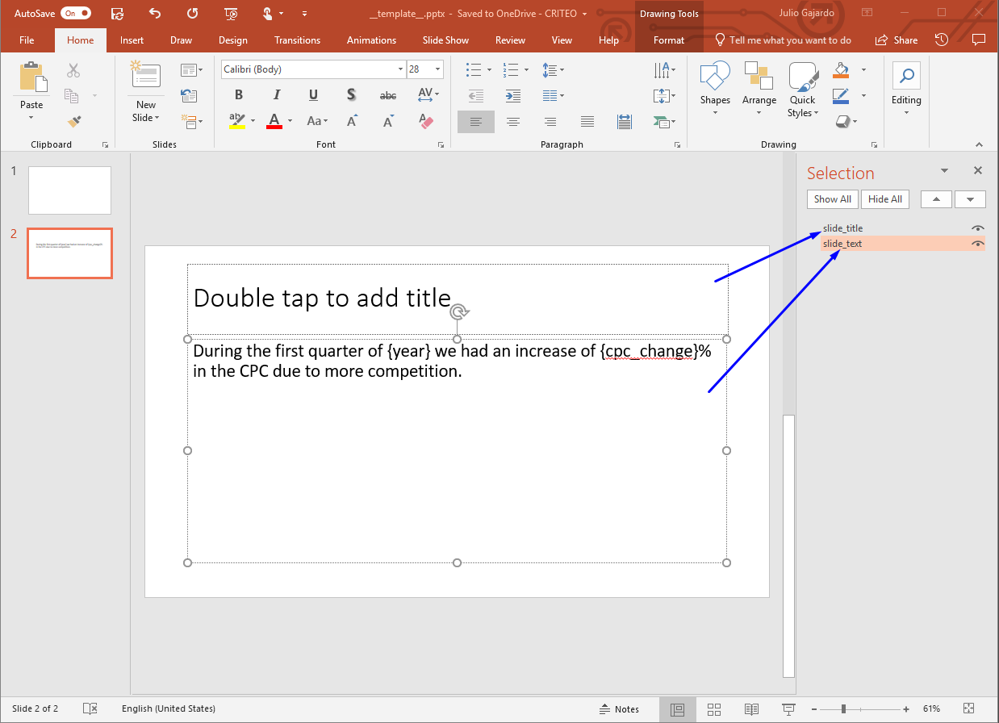
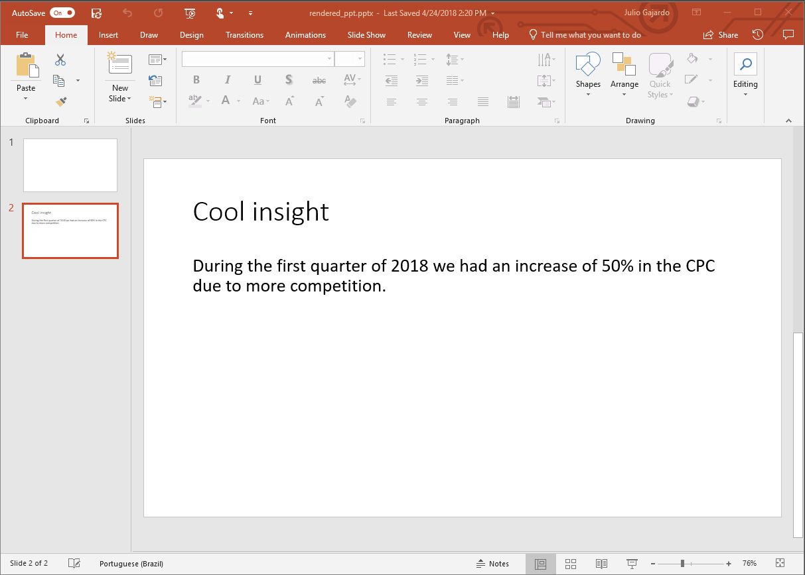

# pypyt 0.0.3
It is a simple library to render PowerPoint presentations using python

# How to install it:


    pip install pypyt


# How to use it:
- You need to create a template file with the objects named as shown in [this video](https://www.youtube.com/watch?v=IhES3of_9Nw).

Lets assume that you have a template file named \_\_template\_\_.pptx with two shapes: *presentation_title* and
*client_name* (as shown in the image below), in order to render it you might use the following code:


````python
    from pypyt import *

    values = {
        'presentation_title': "This is a cool presentation",
        'client_name': "Cool Client"
    }

    render_and_save_ppt('__template__.pptx', values, 'rendered_ppt.pptx')
````
    
This will render a presentation like the one below.



# Reference

There are three main objects: Paragraphs, Charts and Tables.

## Paragraph
There are two options, you might want to replace the whole text or a placeholder within the paragraph.
If you want to replace the whole text, pass a dictionary where the key is the name of the shape in the PowerPoint
template, and the value is the string to be rendered. If you want to render placeholders within the shape, add the
placeholders keys wrapped in curly brackets {}, then create a dictionary with the key having the name of the shape in
the presentation and the value another dictionary where the keys are the names of placeholders and the values are the
strings to be rendered.

- Template


- Code
````python
    values = {
        'slide_title': "Cool insight",
        'slide_text': {
            'year': 2018,
            'cpc_change': 50
        }
    }

    render_and_save_ppt('__template__.pptx', values, 'rendered_ppt.pptx')
````

- Output


## Charts

- Template


- Code
````python
    values = {
        'chart': {
            'title': "Cool Graph",
            'data': {
                'displays': [500, 750, 600, 450, 500, 700, 550],
                'clicks': [250, 150, 350, 300, 175, 275, 125]
            },
            'categories': ['day1', 'day2', 'day3', 'day4', 'day5', 'day6', 'day7']
        }
    }
    
    render_and_save_ppt('__template__.pptx', values, 'rendered_ppt.pptx')
````

- Output

    
## Tables

- Template


- Code
 ````python
    values = {
        'table': [
            ['header1', 'header2', 'header3'],
            ['cell1', 'cell2', 'cell3'],
            ['cell4', 'cell5', 'cell6']
        ]
    }
    
    render_and_save_ppt('__template__.pptx', values, 'rendered_ppt.pptx')
````

- Output


# Contact
If you're trying to use this and want to extend it, have any request or need help, just ping me on slack (j.gajardo) or
send me an email to j.gajardo@criteo.com